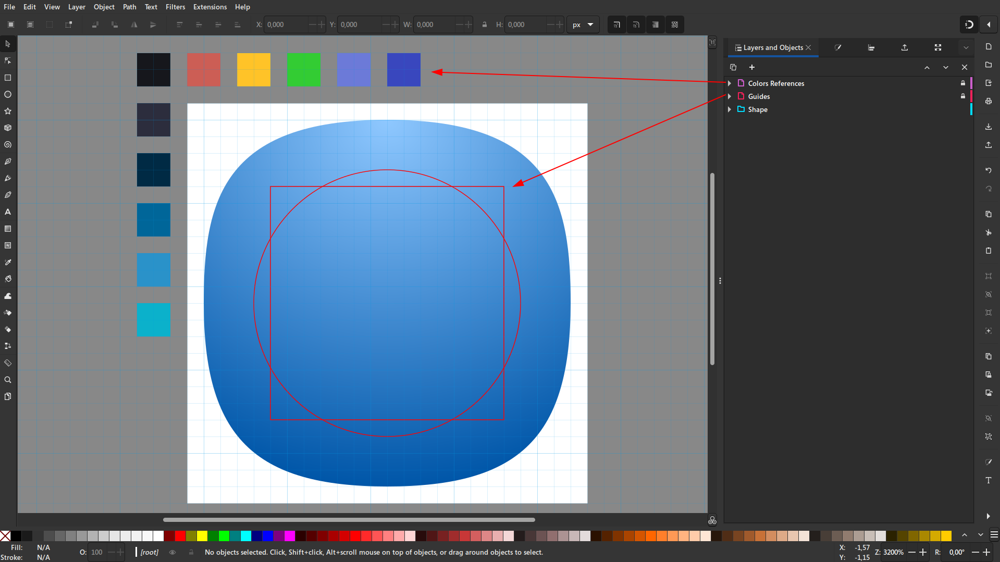

# Templates

Esse template visa simplificar o processo de criação de ícones do projeto.

  

## Referências
- [The Noun Project](https://thenounproject.com/icon/squircle-202668)
- [IBM Design Language](https://design-language-website.netlify.app/design/language/iconography/ui-icons/design)
