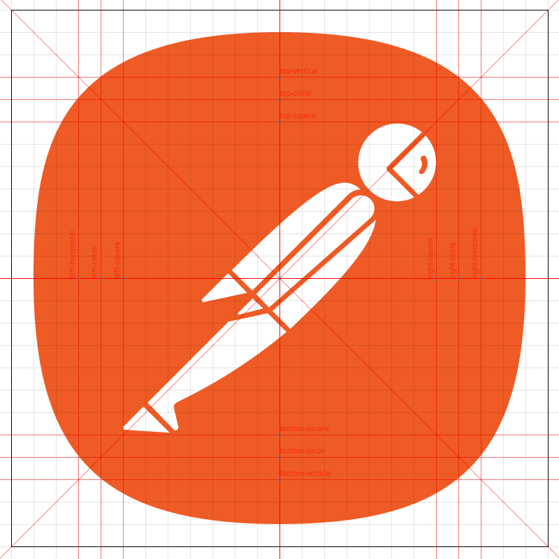
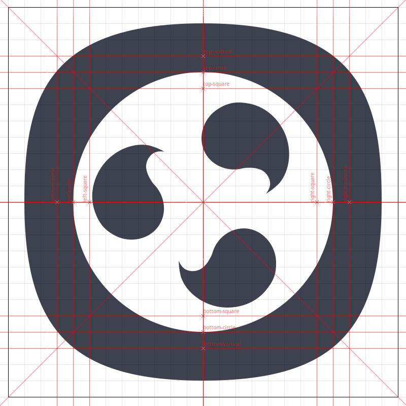
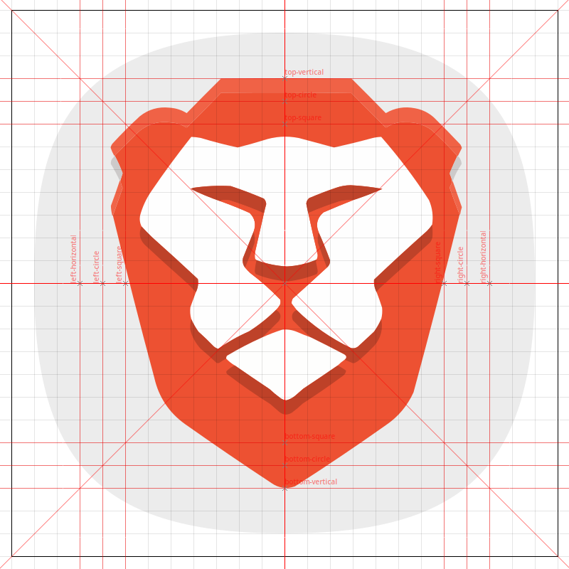
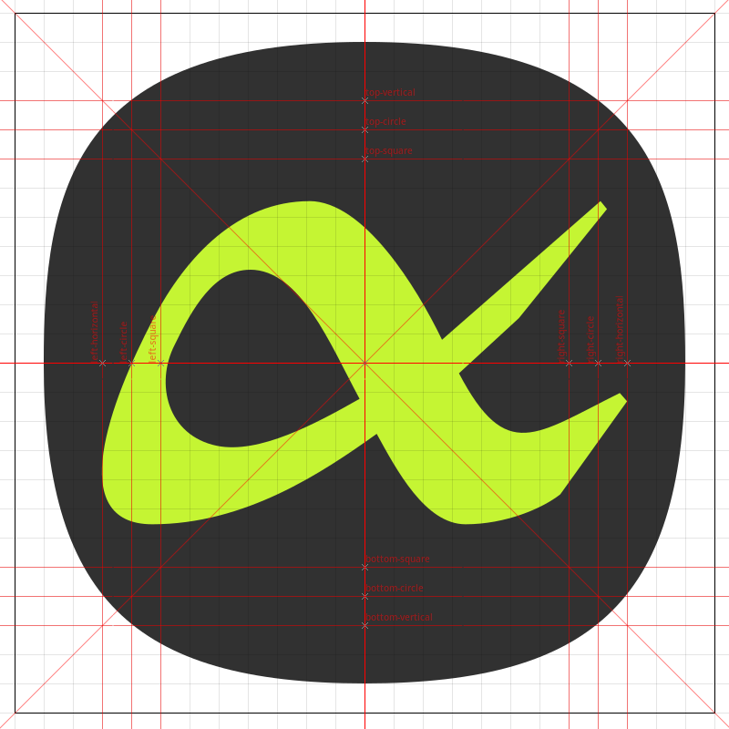

# Templates

This template aims to simplify the process of creating project icons.

<table>
  <tr>
    <td align="center">Square icon</td>
    <td align="center">Circle icon</td>
  </tr>
  <tr>
    <td align="center">Vertical icon</td>
    <td align="center">Horizontal icon</td>
  </tr>
</table>

## References
- [The Noun Project](https://thenounproject.com/icon/squircle-202668)
- [IBM Design Iconnography](https://www.ibm.com/design/language/iconography/ui-icons/design/)
